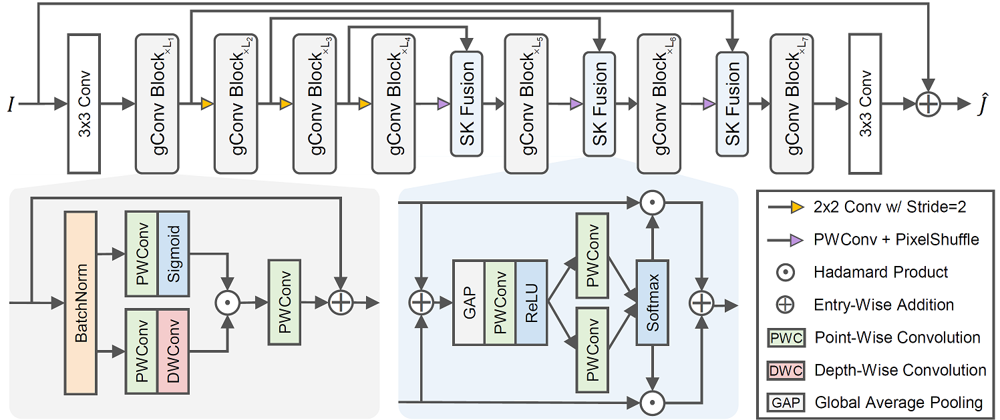

# Rethinking Performance Gains in Image Dehazing Networks

[](https://arxiv.org/abs/2209.11448)
[](https://drive.google.com/drive/folders/1SwxS-t0zOsV6yrATEk54sGG5ntMyM6CH?usp=sharing) 
[](https://drive.google.com/drive/folders/1JZZONxfTTxOi4szFVPTfWewo6mfs7afU?usp=sharing)
[](https://drive.google.com/drive/folders/1mAFXqGUbmvUT4plFoBlnxBb9nnCGvsh0?usp=sharing)

> **Abstract:** 
Image dehazing is an active topic in low-level vision, and many image dehazing networks have been proposed with the rapid development of deep learning.
Although these networks' pipelines work fine, the key mechanism to improving image dehazing performance remains unclear.
For this reason, we do not target to propose a dehazing network with fancy modules; rather, we make minimal modifications to popular U-Net to obtain a compact dehazing network.
Specifically, we swap out the convolutional blocks in U-Net for residual blocks with the gating mechanism, fuse the feature maps of main paths and skip connections using the selective kernel, and call the resulting U-Net variant gUNet.
As a result, with a significantly reduced overhead, gUNet is superior to state-of-the-art methods on multiple image dehazing datasets.
Finally, we verify these key designs to the performance gain of image dehazing networks through extensive ablation studies.

### Network Architecture



### News

- **Oct 8, 2022:** All codes, pre-trained models, and training logs are released, including models in ablation studies.

## Getting started

### Install

We test the code on PyTorch 1.12.1 + CUDA 11.3 + cuDNN 8.3.2.

1. Create a new conda environment
```
conda create -n pt1121 python=3.9
conda activate pt1121
```

2. Install dependencies
```
conda install pytorch=1.12.1 torchvision torchaudio cudatoolkit=11.3 -c pytorch
pip install -r requirements.txt
```

### Download

You can download the pretrained models and datasets on [GoogleDrive](https://drive.google.com/drive/folders/1GeiMvMMn9BoH6x6YabRrimA1LIDakbWb?usp=sharing).

The final file path should be the same as the following:

```
┬─ save_models
│   ├─ reside-in
│   │   ├─ gunet-t.pth
│   │   └─ ... (model name)
│   └─ ... (exp name)
└─ data
    ├─ ITS
    │   ├─ GT
    │   │   └─ ... (image filename)
    │   └─ IN
    │       └─ ... (corresponds to the former)
    └─ ... (dataset name)
```

## Training and Evaluation

### Train

You can modify the training settings for each experiment in the `configs` folder.
Then run the following script to train the model:

```sh
torchrun --nproc_per_node=4 train.py --model (model name) --train_set (train subset name) --val_set (valid subset name) --exp (exp name) --use_mp --use_ddp
```

For example, we train the gUNet-B on the ITS:

```sh
torchrun --nproc_per_node=4 train.py --model gunet_b --train_set ITS --val_set SOTS-IN --exp reside-in --use_mp --use_ddp
```

Note that we use mixed precision training and distributed data parallel by default.

### Test

Run the following script to test the trained model:

```sh
python test.py --model (model name) --test_set (test subset name) --exp (exp name)
```

For example, we test the gUNet-B on the SOTS indoor set:

```sh
python test.py --model gunet_b --test_set SOTS-IN --exp reside-in
```

All test scripts can be found in `run.sh`.

### Overhead

Run the following script to compute the overhead:

```sh
python profile.py --model (model name)
```

For example, we compute the #Param / MACs / Latency of gUNet-B:

```sh
python profile.py --model gunet-b
```

## Citation

If you find this work useful for your research, please cite our paper:

```bibtex
@article{song2022vision,
  title={Rethinking Performance Gains in Image Dehazing Networks},
  author={Song, Yuda and Zhou, Yang and Qian, Hui and Du, Xin},
  journal={arXiv preprint arXiv:2209.11448},
  year={2022}
}
```
